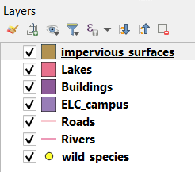
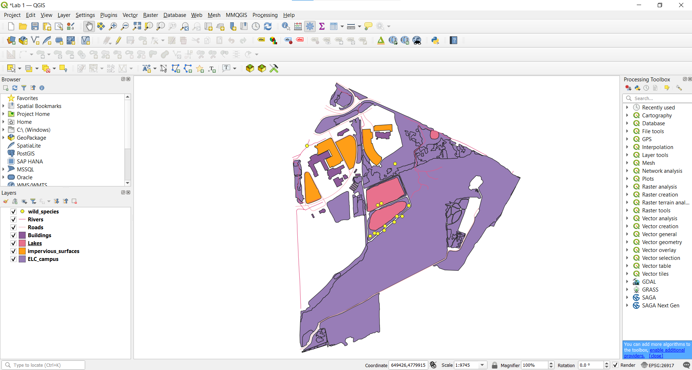

|LS| Adding your first layers
===============================================================================

You are now officially starting Lab 1! This lab will be broken down into several
sections and tackled over the first few weeks of the course.  Before 
starting, mae sure you have QGIS version 3.22 installed and you have created a separate 
folder for Lab 1, as discussed in our first lecture.  

Lab 1 will be broken into three parts:

   Part A:  
   
#. Introduce you to QGIS interface and functionality
#. Learn to load vector data, navigate the map canvas and adjust layer 
   symbology
#. Explore vector attribute tables, add labels and classify vector data
#. Create a map in Layout Manager with all necessary map elements and save as
   a Georeferenced PDF.

   The map will show Niagara College Campus wild species monitoring project locations
   in relation to ELC classes.

   Part B:

#. Learn to edit layer topology and digitize features
#. Produce a map based on your ENVR1108 Environmental Ecology term project. 

   Part C:

#. Use the QGIS plugin QField to perform ground truthing of your map from Part B.
#. Also use a GPS to collect point locations
#. Upload data from QField and GPS into QGIS
#. Create a GeoPackage 

All Lab 1 data should 
have been downloaded from Blackboard and put in your Lab 1 folder as well.  
We will now start the application, and create a basic map to use for examples, 
exercises and Lab 1 deliverables.

**The goal for this lesson:** To get started with an example map.

Launch QGIS from its desktop shortcut, menu item, etc., depending on how you
configured its installation.

.. note::  The screenshots for this course were taken in QGIS 3.14 running on
   Linux and QGIS 3.22 running on Windows. Depending on your setup, the screens you 
   encounter may well appear somewhat different. However, all the same buttons 
   will still be available, and the instructions will work on any OS. You will 
   need QGIS 3.4 (the latest version at time of writing) to use this course.

Let's get started right away!

.. _tm_prepare_a_map:

|basic| |FA| Prepare a map
-------------------------------------------------------------------------------

#. Open QGIS. You will have a new, blank map.

   .. figure:: img/add_blank_qgis.png
      :align: center
      :width: 100 %

#. The first thing you will do is navigate to `Settings --> Options` at the
   top of the new window.

   .. figure:: img/Basic_map_settings_options.png
      :align: center
      :width: 100 % 
   
#. Once in `Options`, you will navigate to `CRS for Projects`
   and `CRS for Layers` and adjust the settings so they match the image below.

   .. figure:: img/Basic_map_CRS.png
      :align: center
      :width: 100 %

   .. note:: You have just set a default map projection.  This will be discussed
   later in the course, but understand that it is important to ensure accurate mapping
   and geometry calculations. 

#. The :guilabel:`Data Source Manager` dialog allows you to choose the data to
   load depending on the data type. We'll use it to load our dataset:
   click the |dataSourceManager| :sup:`Open Data Source Manager` button.

   If you can't find the icon, check that the :guilabel:`Data Source Manager`
   toolbar is enabled in the :menuselection:`View --> Toolbars` menu.

   .. figure:: img/add_data_dialog.png
      :align: center
      :width: 100 %

#. Load the :file:`ELC_campus.shp` vector dataset:
   
   #. Click on the :guilabel:`Vector` tab.
   #. Enable the |radioButtonOn|:guilabel:`File` source type.
   #. Press the :guilabel:`...` button next to :guilabel:`Vector Dataset(s)`.
   #. Select the :file:`Lab 1/ELC_campus.shp` file
      in your working directory.
   #. Click :guilabel:`Open`. You will see the original dialog,
      with the file path filled in.

      .. figure:: img/Basic_map_vector.png
         :align: center

   #. Click :guilabel:`Add` here as well. The data you specified will now load:
      you can see a ``ELC_campus`` item in the :guilabel:`Layers` panel
      (bottom left) with its features shown in the main map canvas.

      .. figure:: img/ELC_campus_preparation.png
         :align: center
         :width: 100%

Congratulations! You now have a basic map. Now would be a good time to save
your work.

#. Click on the :guilabel:`Save As` button: |fileSaveAs|
#. Save the map under a :file:`solution` folder next to :file:`exercise_data`
   and call it :file:`basic_map.qgz`.

.. _backlink-interface-preparation-1:

|basic| |TY|
-------------------------------------------------------------------------------

Repeat the steps above to add the :file:`wild_species.shp` and :file:`rivers.shp`
layers from the same folder (:file:`Lab 1/`) to the map.

.. admonition:: Answer
   :class: dropdown

   In the main area of the dialog you should see many shapes with different
   colors. Each shape belongs to a layer you can identify by its color in the
   left panel (your colors may be different from the ones in :numref:`figure_basic_map` below):

   .. _figure_basic_map:

   .. figure:: img/Basic_map_riversspecies.png
      :align: center

      A basic map

.. _load_geopackage:

|basic| |FA| Loading vector data from a GeoPackage Database
-------------------------------------------------------------------------------

Databases allow you to store a large volume of associated data in one file. You
may already be familiar with a database management system (DBMS) such as
Libreoffice Base or MS Access. GIS applications can also make use of databases.
GIS-specific DBMSes (such as PostGIS) have extra functions, because they need to
handle spatial data.

The `GeoPackage <https://www.geopackage.org/>`_ open format is a container that
allows you to store GIS data (layers) in a single file.
Unlike the ESRI Shapefile format (e.g. the :file:`ELC_campus.shp` dataset
you loaded earlier), a single GeoPackage file can contain various data (both
vector and raster data) in different coordinate reference systems, as well as
tables without spatial information; all these features allow you to share data
easily and avoid file duplication.

In order to load a layer from a GeoPackage, you will first need to create the
connection to it:

#. Click on the |dataSourceManager| :sup:`Open Data Source Manager` button.
#. On the left click on the |newGeoPackageLayer| :guilabel:`GeoPackage` tab.
#. Click on the :guilabel:`New` button and browse to the :file:`Lab_1.gpkg`
   file in the :file:`Lab_1` folder you downloaded before.
#. Select the file and press :guilabel:`Open`. The file path is now added to the
   Geopackage connections list, and appears in the drop-down menu.

You are now ready to add any layer from this GeoPackage to QGIS.

#. Click on the :guilabel:`Connect` button.
   In the central part of the window you should now see the list of all the layers
   contained in the GeoPackage file.
#. Select the :guilabel:`roads` layer and click on the :guilabel:`Add` button.

   .. figure:: img/Basic_map_geopackage.png
      :align: center

   A :guilabel:`roads` layer is added to the :guilabel:`Layers` panel with
   features displayed on the map canvas.
#. Now do the same for `Buildings`, and then click on :guilabel:`Close`.

Congratulations! You have loaded your first layers from a GeoPackage.

.. _backlink-vector-load-from-database-1:

|moderate| |TY| Load More Vector Data
-------------------------------------------------------------------------------

Load the following datasets from the :file:`Lab_1` folder into your map
using any of the methods explained above:

* :guilabel:`impervious_surfaces`
* :guilabel:`Lakes`

.. admonition:: Answer
   :class: dropdown

   Your map should have seven layers:

   * :guilabel:`ELC_campus`
   * :guilabel:`wild_species`
   * :guilabel:`rivers`
   * :guilabel:`roads`
   * :guilabel:'impervious_surfaces'
   * :guilabel:`buildings` (taken from :file:`Lab_1a.gpkg`) and
   * :guilabel:`Lakes` (taken from :file:`Lab_1/`).

|FA| Reordering the Layers
-------------------------------------------------------------------------------

The layers in your Layers list are drawn on the map in a certain order. The
layer at the bottom of the list is drawn first, and the layer at the top is
drawn last. By changing the order that they are shown on the list, you can
change the order they are drawn in.

.. note:: You can alter this behavior using the :guilabel:`Control rendering
   order` checkbox beneath the :guilabel:`Layer Order` panel. We will
   however not discuss this feature yet.

The order in which the layers have been loaded into the map is probably not
logical at this stage. It's possible that the road layer is completely hidden
because other layers are on top of it.

For example, this layer order...

... would result in roads and wild_species being hidden as they run *underneath*
the polygons of the landuse layer.

To resolve this problem:

#. Click and drag on a layer in the Layers list.
#. Reorder them to look like this:

You'll see that the map now makes more sense visually, with roads and buildings
appearing above the land use regions.

|IC|
-------------------------------------------------------------------------------

Now you've added all the layers you need from several different sources
and created a basic map!

|WN|
-------------------------------------------------------------------------------

Now you're familiar with the basic function of the :guilabel:`Open Data Source Manager`
button, but what about all the others? How does this interface work? Before we
go on, let's take a look at some basic interaction with the QGIS interface.
This is the topic of the next lesson.

.. Substitutions definitions - AVOID EDITING PAST THIS LINE
   This will be automatically updated by the find_set_subst.py script.
   If you need to create a new substitution manually,
   please add it also to the substitutions.txt file in the
   source folder.

.. |FA| replace:: Follow Along:
.. |IC| replace:: In Conclusion
.. |LS| replace:: Lesson:
.. |TY| replace:: Try Yourself
.. |WN| replace:: What's Next?
.. |basic| image:: /static/common/basic.png
.. |dataSourceManager| image:: /static/common/mActionDataSourceManager.png
   :width: 1.5em
.. |dbSchema| image:: /static/common/mIconDbSchema.png
   :width: 1.5em
.. |fileOpen| image:: /static/common/mActionFileOpen.png
   :width: 1.5em
.. |fileSaveAs| image:: /static/common/mActionFileSaveAs.png
   :width: 1.5em
.. |geoPackage| image:: /static/common/mGeoPackage.png
   :width: 1.5em
.. |moderate| image:: /static/common/moderate.png
.. |newGeoPackageLayer| image:: /static/common/mActionNewGeoPackageLayer.png
   :width: 1.5em
.. |polygonLayer| image:: /static/common/mIconPolygonLayer.png
   :width: 1.5em
.. |radioButtonOn| image:: /static/common/radiobuttonon.png
   :width: 1.5em
.. |spatialite| image:: /static/common/mIconSpatialite.png
   :width: 1.5em
