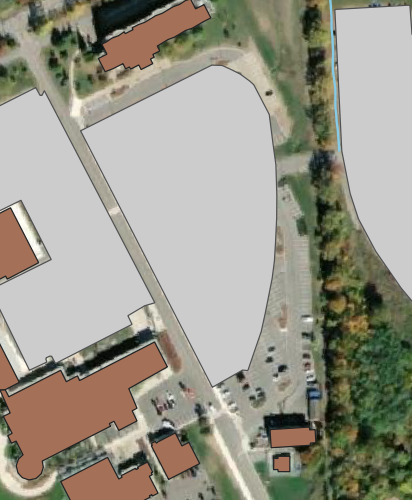

|LS| Feature Topology
======================================================================

Topology in simple terms refers to the shared vertices/nodes and edges adjacent 
polygon features,and connectivity between line features. Topology is a useful 
aspect of vector data layers, because it minimizes errors such as overlap or 
gaps. If you look at our polygon datasets, only 'ELC_campus' has feature topology. 
The other polygon datasets represent stand alone features that do not share any 
nodes or edges. The line features, 'rivers' and 'roads' also have feature topology, 
as various features are connected creating a network.

Topological editing is useful when two features share a border, because when you edit
the border of one feature, the border of the other feature will automatically update.
That way you won't need to edit first one feature, then another, and
carefully line up the borders so that they match. Instead, you can edit their
shared border and both features will change at the same time.

For part B of Lab 1 you will (1) edit existing shapefiles used to create your map
from Part A of Lab 1 and (2) create a new vector layer based on maps you created 
in your Environmental Ecology course.  When we started working with the campus data,
you may have noticed that the base map was from 2006.  However, we now want to
update our map so that your next map is current. 

First open up your existing QGIS file title Campus Ecology. Once it is open, navigate to
`Project --> Save as...`, and save a new copy of the project in the exercise_data folder.
Call is Campus Ecology 2018. Once you have saved your new QGIS project, you are ready to
start Part B. Building off of your existing map, you will remove the `ELC_campus` layer 
from your map.

**The goal for this lesson:** To understand topology using examples.

|basic| |FA| Data Sources
-------------------------------------------------------------------------------

When you create new data, it obviously has to be about objects that really
exist on the ground. Therefore, you'll need to get your information from
somewhere.

There are many different ways to obtain data about objects. For example, you
could use a GPS to capture points in the real world, then import the data into
QGIS afterwards. Or you could survey points using a theodolite, and enter the
coordinates manually to create new features. Or you could use the digitizing
process to trace objects from remote sensing data, such as satellite imagery
or aerial photography.

For our example, you'll be using the digitizing approach. Sample raster datasets
are provided, so you'll need to import them as necessary.

#. Click on |dataSourceManager| :sup:`Data Source Manager` button.
#. Select |raster| :guilabel:`Raster` on the left side.
#. In the :guilabel:`Source` panel, click on the :guilabel:`...` button: 
#. Navigate to :file:`exercise_data/raster/`.
#. Select the file :file:`3420C_2010_327_RGB_LATLNG.tif`.
#. Click :guilabel:`Open` to close the dialogue window.

   .. figure:: img/add_raster.png
     :align: center

#. Click :guilabel:`Add` and :guilabel:`Close`. An image will load into your map.

   .. figure:: img/raster_added.png
     :align: center

#. If you don't see an aerial image appear, select the new layer, right click,
   and choose :guilabel:`Zoom to Layer` in the context menu.

   .. figure:: img/zoom_to_raster.png
     :align: center

#. Click on the |zoomIn| :sup:`Zoom In` button, and zoom to the area highlighted in blue below:

   .. figure:: img/map_area_zoom.png
     :align: center

Now you are ready to digitize these three fields:

   .. figure:: img/field_outlines.png
     :align: center

Before starting to digitize, let's move the ``school_property`` layer above the aerial image.

#. Select ``school_property`` layer in the :guilabel:`Layers` pane and drag it to the top.

.. figure:: img/move_school_layer.png
     :align: center

Alternatively, raster data can be loaded with the :guilabel:`Browser` Panel. In fact, this
method is easier, and can also be used to load vector data.

#. Open the :guilabel:`Browser` Panel and expand the
   :file:`exercise_data/raster` folder.
#. Load all the data in this folder:

   * :file:`3320C_2010_314_RGB_LATLNG.tif`
   * :file:`3320D_2010_315_RGB_LATLNG.tif`
   * :file:`3420B_2010_328_RGB_LATLNG.tif`
   * :file:`3420C_2010_327_RGB_LATLNG.tif`

You should see the following map:

.. figure:: img/raster_step_one.png
   :align: center

|basic| |FA| Deleting Polygons and Editing Existing Shapefiles
----------------------------------------------------------------------

You probably noticed that there are a few extra buildings that are
no longer on the basemap.  We want to remove these buildings
from the ``buildings`` layer. However, we do not want to edit the
existing ``buildings`` shapefile. To avoid this, we will make a copy:

#. Right click on the ``buildings`` layer in the Layer panel and go to
   `Export --> Save Features As...`
#. Call the new ``buildings`` shapefile ``buildings_new``
#. Click OK and ensure the new layer is added to your QGIS session.

In order to begin editing ``buildings_new``, you'll need to enter **edit mode**. GIS software
commonly requires this to prevent you from accidentally editing or deleting
important data. Edit mode is switched on or off individually for each layer.

To enter edit mode for the ``buildings_new`` layer:

#. Click on the ``buildings_new`` layer in the :guilabel:`Layers` panel to select it.
#. Click on the |toggleEditing| :sup:`Toggle Editing` button.

   If you can't find this button, check that the :guilabel:`Digitizing` toolbar is
   enabled. There should be a check mark next to the :menuselection:`View -->
   Toolbars --> Digitizing` menu entry.

   As soon as you are in edit mode, you'll see that some editing tools have become
   active:

     - |capturePolygon| :sup:`Capture Polygon`
     - |vertexToolActiveLayer| :sup:`Vertex Tool`

   Other relevant buttons are still inactive, but will become active when
   we start interacting with our data.

   Notice that the layer ``buildings_new`` in the :guilabel:`Layers` panel now
   has the pencil icon, indicating that it is in edit mode.

Now that you are in edit mode, you are ready to delete a feature.

#. Click on |mActionSelectRectangle| :sup:`Select Features by Area or Single Click` button.
#. Navigate to the feature you would like to remove, and click it.
#. Once clicked, you can push delete on your keyboard. If you make an error, you can use
   keyboard short-cut CTRL Z to undo. 

 .. figure:: img/Topo_buildingsdelete.png
     :align: center

#. Now delete all the buildings that are no longer visible on the basemap.

You may have also noticed that there are a few new buildings on the basemap.  We want to
map these new features. To do this, we will perform digitizing.  

#. To digitize a feature click on the |capturePolygon| :sup:`Capture Polygon` 
   button to begin digitizing the new buildings.

   You'll notice that your mouse cursor has become a crosshair. This allows you to
   more accurately place the points you'll be digitizing. Remember that even when
   you're using the digitizing tool, you can zoom in and out on your map by
   rolling the mouse wheel, and you can pan around by holding down the mouse wheel
   and dragging around in the map.

#. Start digitizing by clicking on a point somewhere along the edge of the building.
#. Place more points by clicking further along the edge, until the shape you're
   drawing completely covers the building.
  
   .. figure:: img/Topo_digitize.png
     :align: center

#. After placing your last point, right click to finish drawing the polygon.
   This will finalize the feature and show you the :guilabel:`Attributes` dialog.
#. Leave the attribute field blank for now. Click :guilabel:`OK`.

   .. figure:: img/Topo_newattribute.png
     :align: center

#. You have created a new feature!

   .. figure:: img/Topo_newfeature.png
     :align: center

#. Navigate to the attribute table and 

#. In the :guilabel:`Layers` panel select the ``buildings_new`` layer.
#. Right click and choose :guilabel:`Open Attribute Table` in the context menu.

   In the table you will see the feature you just added. While in edit mode you 
   can update the attributes data by double click on the cell you want to update. 
   Take a look at the different 'UniqueID' values. We will discuss this in class, 
   but for now, enter '001' and leave the other fields empty.

   .. figure:: img/Topo_attributetable.png
     :align: center

#. Close the attribute table.
#. To save the new feature we just created, click on |saveEdits| :sup:`Save Edits` button.

Remember, if you've made a mistake while digitizing a feature, you can always
edit it after you're done creating it. If you've made a mistake, continue
digitizing until you're done creating the feature as above. Then:

#. Click on |vertexToolActiveLayer| :sup:`Vertex Tool` button.
#. Hover the mouse over a vertex you want to move and left click on the vertex.
#. Move the mouse to the correct location of the vertex, and left click.
   This will move the vertex to the new location. The same procedure can be 
   used to move a line segment, but you will need to hover over the midpoint 
   of the line segment. The image below shows how I updated the polygon, and 
   also shows how each vertex is highlighted, with the red 'X' at the midpoint.  
   If you click the red 'X', a new vertex can be added and dragged to add a new 
   vertex to your polygon.

   .. figure:: img/Topo_buildingupdate.png
     :align: center

   If you want to undo a change, you can press the |undo| :sup:`Undo` button or :kbd:`Ctrl+Z`.

#. Remember to save your changes by clicking the |saveEdits| :sup:`Save Edits` button.
#. When done editing, click the |toggleEditing| :sup:`Toggle Editing` button
   to get out of edit mode.

|moderate| |TY| Tool: Add Ring
----------------------------------------------------------------------

Topology features can sometimes need to be updated.
In our study area, you may notice that with the new basemap, the buildings, 
roads, lakes and impervious surfaces no longer align with the base map. We will start
by editing `impervious_surfaces`. Remember, we will first make a copy as we did
for `buildings_new`. We will call it `impervious_surfaces_new`.

The |addRing| :sup:`Add Ring` tool allows you to add an interior ring
to a polygon feature (cut a hole in the polygon), as long as the hole
is completely contained within the polygon (touching the boundary is
OK).
For the parking lot along Taylor Rd., you may notice the polygon covers
an area that has trees.  Use the tool to cut out these areas.

#. First, make sure you are in edit mode for ``impervious_surfaces`` 
#. Then click the |addRing| :sup:`Add Ring` tool to start

   You may find digitizing an accurate ring easier if you adjust the
   symbology, so there is 'No Brush', and just a border.

   .. figure:: img/Topo_nobrush.png
      :align: center

#. Then simply digitize along the boundary of the feature you are wanting
   to cut out
#. Once done, right click to complete the polygon. Once you you change the 
   symbology back to 'Solid' fill, you will have something that looks like this:

   .. figure:: img/Topo_ring.png
      :align: center

   Include these edits in your map for Lab 1 Part B.

|moderate| |FA| Correct Topological Features
----------------------------------------------------------------------

We are going to use the *Vertex Tool* to edit the 'East Parking Lot' from the
``impervious_surfaces`` layer, so that it aligns with the basemap. We used 
this same tool when we were editing our 'building' polygon that we digitized.

#. Select the |vertexToolActiveLayer| :sup:`Vertex Tool`.
#. Hover over the 'East Parking Lot' (which will show all the vertices highlighted
   in red) select a vertex, and move it to the edge of the parking lot shown on 
   the basemap:

   .. figure:: img/Topo_parkinglotedit.png
      :align: center

#. Click on the other vertices and continue to drag them to the edge of the
   parking lot until the polygon covers the entire parking lot.

   The correct border looks like this:

   .. figure:: img/Topo_newboundary.png
      :align: center

Undo these changes, as we will next use another topological editing tool to achieve
the same goal.

|moderate| |FA| Snapping
----------------------------------------------------------------------

For this next task, we will activate 'Snapping'. Snapping makes topological 
editing easier. This will allow your mouse cursor to snap to other objects 
while you digitize. 

To set snapping options:

#. Navigate to the menu entry
   :menuselection:`Project --> Snapping Options...`.
#. Set up your :guilabel:`Snapping options` dialog to match the settings
   shown below.

   .. figure:: img/Topo_snapping.png
      :align: center

#. Exit the dialog.

If you experiment with the tool, you may notice that the snapping
options can prevent you from creating a ring inside a polygon, or 
sometimes may snap to an unwanted vertex. If these issues are occurring, 
turn off snapping or adjust the tolerance.

Now, let's take a moment to explore the topology ``ELC_campus`` layer.

#. Enter editing mode for ``ELC_campus``.
#. Zoom in on an area with multiple polygons, and hover your mouse over various
   adjacent polygons. 

   .. figure:: img/Topo_sharevertices.png
      :align: center

   What do you notice about the vertices? They are all perfectly aligned! This is
   topology!

#. Now select the |vertexToolActiveLayer| :sup:`Vertex Tool`, and begin to edit the
   the border of one of the polygons. As you move the vertices, you should notice that
   the edge of the adjacent polygon is automatically moving as well.

   .. figure:: img/Topo_autochange.png
      :align: center

#. Now undo these changes, and exit 'Edit' mode.

|moderate| |FA| Tool: Reshape Features
----------------------------------------------------------------------

The |reshape| :sup:`Reshape Features` tool is used to extend a polygon
feature or cut away a part of it (along the boundary). We will use it
to extend the East Parking Lot. So undo your previous edits, and we will
start again with reshaping the East Parking Lot.

Extending:

#. Select the polygon using the |selectRectangle|
   :sup:`Select Features by area or single click` tool.
#. Hover over the southern most vertex, so that you can see the purple snapping
   box appear, and then left-click on the vertex to start drawing.
#. Draw a shape to extend the parking lot outside the polygon. The last vertex should be back
   inside the polygon.
#. Right-click to finish the shape:

   .. figure:: img/Topo_reshapeadd.png
      :align: center

Cut away a part:

#. Select the polygon using the |selectRectangle|
   :sup:`Select Features by area or single click` tool.
#. Click outside the polygon.
#. Draw a shape inside the polygon. The last vertex must be back
   outside the polygon.
#. Right-click outside the polygon.

Note:

You may need to touch up the border by using the 
|vertexToolActiveLayer| :sup:`Vertex Tool`.

Include these edits in your map for Lab 1 Part B.

|moderate| |TY| Tool: Add Part
----------------------------------------------------------------------

The |addPart| :sup:`Add Part` tool allows you to add a new part to a
feature, that is not directly connected to the main feature.
For example, if you have digitized the boundaries of mainland South
Africa, but you haven't yet added the Prince Edward Islands, you
would use this tool to create them.

#. Select the 'East Parking Lot' polygon by using the
   |selectRectangle| :sup:`Select Features by area or single click`
   tool.

   .. figure:: img/Topo_addPart.png
         :align: center

#. Use the :guilabel:`Add Part` tool to add a small section of parking lot.

   .. figure:: img/Topo_partadded.png
         :align: center

Include these edits in your map for Lab 1 Part B.

|hard| |TY| Tool: Merge Features
----------------------------------------------------------------------

Now we will join multiple features from the ``Rivers`` layer. 

#. Ensure you have created a new ``Rivers`` layer (i.e., Rivers_new) and
   the new layer is in 'Edit' mode, then navigate to the area of the
   map shown below.

   .. figure:: img/Topo_river.png
      :align: center

#. First select all the line segments you wish to merge using the 
   |selectRectangle| :sup:`Select Features by area or single click`
   tool while holding down Ctrl on your keyboard. There should be 7 segments.

   .. figure:: img/Topo_riverselect.png
      :align: center

#. Then click the :guilabel:`Merge Selected Features` tool.  A dialog box will appear.

#. Select 'Take all attributes from the Line feature with the longest length' option

   .. figure:: img/Topo_mergedialog.png
      :align: center

Now that you have completed editing the ``rivers_new`` layer, be sure to
save all changes by clicking on the |toggleEditing| :sup:`Toggle Editing` button. 

|moderate| |TY| Tool: Reshape a Line Feature
----------------------------------------------------------------------

Now, reshape the roads so that it aligns with the new base map. Be sure
to save all your edits!

|IC|
----------------------------------------------------------------------

Topology editing is a powerful tool that allows you to create and modify
objects quickly and easily, while ensuring that they remain topologically
correct.

Be sure to update your new buildings, lakes and impervious surfaces so that
they match the basemap! Do NOT update the ELC_campus layer (too much work)!

|WN|
----------------------------------------------------------------------

Now you know how to digitize the shape of the objects easily! Now we will create
a new shapefile!

.. Substitutions definitions - AVOID EDITING PAST THIS LINE
   This will be automatically updated by the find_set_subst.py script.
   If you need to create a new substitution manually,
   please add it also to the substitutions.txt file in the
   source folder.

.. |FA| replace:: Follow Along:
.. |IC| replace:: In Conclusion
.. |LS| replace:: Lesson:
.. |TY| replace:: Try Yourself
.. |WN| replace:: What's Next?
.. |addPart| image:: /static/common/mActionAddPart.png
   :width: 1.5em
.. |addRing| image:: /static/common/mActionAddRing.png
   :width: 2em
.. |capturePolygon| image:: /static/common/mActionCapturePolygon.png
   :width: 1.5em
.. |deletePart| image:: /static/common/mActionDeletePart.png
   :width: 2em
.. |deleteRing| image:: /static/common/mActionDeleteRing.png
   :width: 2em
.. |hard| image:: /static/common/hard.png
.. |largeLandUseArea| replace:: Bontebok National Park
.. |mergeFeatAttributes| image:: /static/common/mActionMergeFeatureAttributes.png
   :width: 1.5em
.. |mergeFeatures| image:: /static/common/mActionMergeFeatures.png
   :width: 1.5em
.. |moderate| image:: /static/common/moderate.png
.. |redo| image:: /static/common/mActionRedo.png
   :width: 1.5em
.. |reshape| image:: /static/common/mActionReshape.png
   :width: 1.5em
.. |selectRectangle| image:: /static/common/mActionSelectRectangle.png
   :width: 1.5em
.. |simplifyFeatures| image:: /static/common/mActionSimplify.png
   :width: 1.5em
.. |snapping| image:: /static/common/mIconSnapping.png
   :width: 1.5em
.. |splitFeatures| image:: /static/common/mActionSplitFeatures.png
   :width: 1.5em
.. |toggleEditing| image:: /static/common/mActionToggleEditing.png
   :width: 1.5em
.. |undo| image:: /static/common/mActionUndo.png
   :width: 1.5em
.. |vertexToolActiveLayer| image:: /static/common/mActionVertexToolActiveLayer.png
   :width: 1.5em
