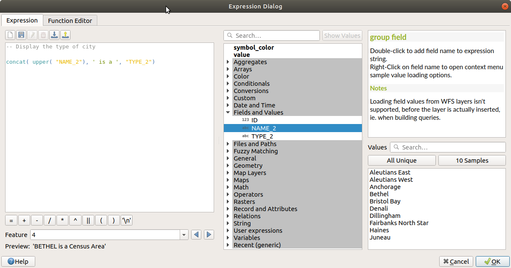

|LS| Lab 2 Part B: Street Tree Management Priority Mapping
===============================================================================

For Lab 2 Part B, you will be selecting one census tract from your 'Select by
Location' output, and creating a street tree management plan for the street
trees that fall within the census tract. Your deliverable will be a field map, that employs 
proper symbology that indicates five different categories for street
tree management, and priortiy ranking. You will have to write a 1 - 2 page report outlining
the five street tree management classes you chose to use, and explain the rational for 
each managementclass, using references.  A list of references must be included with the 
report (not included in the 1-2 pages).

This lab will have you working with:

#. More geoprocessing tools
#. Summary statistics
#. Expressions
#. Classifying point data

As we are approaching the second half of the semester, and you have all been working in
QGIS for several weeks, lab instructions will become less specific, which will require
you to rely on your team and also on using only QGIS sources to assist you with 
completing the lab.

Below is an example of the map I created for the assignment.  Note my five classes.
Selecting my classes, I focused on the following topics:

.. figure:: img/Create_communityseries.png
     :align: center

LDD moth treatment: 

#. Which species are most susceptible?
#. Which age class is most vulnerable?
#. Which areas have the highest density of vulnerable trees?
#. Which trees have the highest quality canopy?

Ash trees monitoring and treatment:

#. Which trees have the highest quality canopy?
#. Which trees are most likely to become hazard trees?
#. Are they European Ash or Native? 

Invasive species:

#. Which species are a priority for removal? 
   #. Small DBH (don't require a permit)
   #. Seed trees?
   #. High quality canopy?
   #. Most agressive regeneration strategies?
   #. Highest density

|basic| |FA| Subsetting data
-------------------------------------------------------------------------------

For this section of the lab, we will start by subsetting both the
'Select by Location' output (my example was 'Toronto_lowtrees_lowincome'),
and 'Street Tree' dataset.

#. You will start by creating a new QGIS project (we are not building off
   of Lab 2 Part A), and adding the 'Select by Location' output and 'Street
   Tree' layers.

#. We then want to subset the 'Select by Location' layer first. Take a look
   at your different census tract features and decide whichtract you want to
   use for your management plan. There is really no criteria for this, use
   your own discretion, but do not choose the same as mine. Use the 'Select 
   Features by Area or Single Click' icon, and click on the census tract you 
   want to use.

   .. figure:: img/Lab2B_selectpoly.png
     :align: center

#. As you did before, export the selected feature. Save it in your 'Lab_2'
   GeoPackage, giving it a meaningful name. I called mine 'CT_0378_24':
   CT = census tract and the number is the census tract number.

#. We now will subset our 'Street Tree' dataset by using the 'Clip' tool.
   Navigate to the 'Vector' tab and then 'Geoprocessing Tools --> Clip'.

   .. figure:: img/Lab2B_clip.png
     :align: center

#. Fill out the clip tool as shown below. Be sure to save it to your
   'Lab_2' GeoPackage. I called mine 'StreetTree_CTclip'.

   .. figure:: img/Lab2B_clipsavetogeo.png
     :align: center

#. We then want to look at the summary statistics of our new subsetted
   'StreetTree_CTclip' layer. Go to the 'Processing' tab --> 'Toolbox'.
   The 'Processing Toolbox' panel will appear on the right side. In the search
   bar, type 'Statistics by categories', and select this option.

   .. figure:: img/Lab2B_statsbycat.png
     :align: center

#. We want to calculate summary statistics for the 'BOTANICAL' field. To
   do this, we will set 'Field to calculate statistics on' as 'BOTANICAL'
   using the dropdown menu. Then under 'Field(s) with categories', click the 
   '...'. Another window will open. Select 'BOTANICAL', as shown below. Be
   sure to save your summary statistics to your 'Lab_2' GeoPackage.

   .. figure:: img/Lab2B_statscatsettings.png
     :align: center

   .. figure:: img/Lab2B_statsfields.png
     :align: center

#. Open your new table and inspect the content. The field you will be most
   interested in is the count field, as this provides a total for each species.
   This is where you have to begin to do some research. Figure out what five
   categories you will be creating for your priority management plan. As you can see,
   my area has a lot of Norway Maple (Acer platanoides), which is an invasive 
   species. Linden (Tilia cordata) are also invasive. Given the current LDD
   moth outbreak, it is a good idea to consider which native trees are most
   susceptible to this pest. Ash species are also always important to consider.
   Here is the list of topics you can consider for creating your priority management
   plan. Feel free to add additional topics.

   .. figure:: img/Lab2B_botstats.png
     :align: center

LDD moth treatment: 

#. Which species are most susceptible?
#. Which age class is most vulnerable?
#. Which areas have the highest density of vulnerable trees?
#. Which trees have the highest quality canopy?

Ash trees monitoring and treatment:

#. Which trees have the highest quality canopy?
#. Which trees are most likely to become hazard trees?
#. Are they European Ash or Native? 

Invasive species:

#. Which species are a priority for removal? 
   #. Small DBH (don't require a permit)
   #. Seed trees?
   #. High quality canopy?
   #. Most agressive regeneration strategies?
   #. Highest density

Rare species

|basic| |FA| Subsetting data using Expressions
-------------------------------------------------------------------------------

Based on layer data and prebuilt or user defined functions, **Expressions**
offer a powerful way to manipulate attribute values and geometry.

The Expression string builder
=============================

Main dialog to build expressions, the :guilabel:`Expression string builder`
is available from many parts in QGIS, most commonly:

* :ref:`selecting features <sec_selection>` with the |expressionSelect| 
  :sup:`Select By Expression...` tool (found in attribute table);
* :ref:`editing attributes <calculate_fields_values>` with e.g. the
  |calculateField| :sup:`Field calculator` tool (found in attribute table);

The Expression builder dialog offers access to the:

* :ref:`Expression tab <functions_list>` which, has a list of predefined
  functions, that helps to write and check expressions;
* :ref:`Function Editor tab <function_editor>` which helps to extend the list of
  functions by creating custom ones.

The Interface
-------------

At this point, we have used 'Expression builder' when calculting a new AREA variable 
in Lab 1, and for creating a new 'Median_Income_num' value in Lab 2 Part A. 
The :guilabel:`Expression` tab provides the main interface to write expressions
using functions, layer fields and values. It contains the following widgets:

.. _figure_expression_tab:

   The Expression tab

* An expression editor area for typing or pasting expressions. Autocompletion is
  available to speed expression writing:

  * Corresponding variables, function names and field names to the input text
    are shown below: use the :kbd:`Up` and :kbd:`Down` arrows to browse the
    items and press :kbd:`Tab` to insert in the expression or simply click
    on the item that is wished to be used.

  QGIS also checks whether the expression is correct and highlights all the errors using:

  * *Underline*: for unknown functions, wrong or invalid arguments;
  * *Marker*: for every other error (eg, missing parenthesis, unexpected
    character) at a single location.

* Above the expression editor, a set of tools helps you:

  * |fileNew|:sup:`Clear the expression editor`
  * create and manage :ref:`user expressions <user_expressions_functions>`

* Under the expression editor, you find:

  * a set of basic operators to help you build the expression
  * an indication of the expected format of output when you are data-defining
    feature properties
  * a live :guilabel:`Output preview` of the expression, evaluated
    on the first feature of the Layer by default.
    You can browse and evaluate other features of the layer using the
    :guilabel:`Feature` combobox (the values are taken from the
    :ref:`display name <maptips>` property of the layer).

    In case of error, it indicates it and you can access the details with the
    provided hyperlink.

* A function selector displays the list of functions, variables, fields...
  organized in groups. A search box is available to filter the list and quickly
  find a particular function or field.
  Double-clicking an item adds it to the expression editor.
* A help panel displays help for each selected item in the function selector.

  .. tip::

   Press :kbd:`Ctrl+Click` when hovering a function name in an expression to
   automatically display its help in the dialog.

  A field's values widget shown when a field is selected in the function selector
  helps to fetch features attributes:

  * Look for a particular field value
  * Display the list of :guilabel:`All Unique` or :guilabel:`10 Samples` values.
    Also available from right-click.

  .. tip::

   The right panel, showing functions help or field values, can be
   collapsed (invisible) in the dialog. Press the :guilabel:`Show Values`
   or :guilabel:`Show Help` button to get it back.

Writing an expression
---------------------

QGIS expressions are used to select features or set values.
Writing an expression in QGIS follows some rules:

#. **The dialog defines the context**: if you are used to SQL, you probably
   know queries of the type *select features from layer where condition*
   or *update layer set field = new_value where condition*.

   A QGIS expression also needs all these information but the tool you use
   to open the expression builder dialog provides parts of them.
   For example, giving a layer (``buildings``) with a field (``height``):

   * pressing the |expressionSelect|:sup:`Select by expression` tool means that
     you want to "select features from buildings". The **condition** is the
     only information you need to provide in the expression text widget,
     e.g. type ``"height" > 20`` to select buildings that are higher than 20.
   
   * with this selection made, pressing the |calculateField| :sup:`Field calculator`
     button and choosing "height" as :guilabel:`Update existing field`, you already
     provide the command "update buildings set height = ??? where height > 20".
     The only remaining bits you have to provide in this case is the **new value**,
     e.g. just enter ``50`` in the expression editor textbox to set the height
     of the previously selected buildings.

#. **Pay attention to quotes**: single quotes return a literal, so a
   text placed between single quotes (``'145'``) is interpreted as a string.
   Double quotes will give you the value of that text so use them for fields
   (``"myfield"``). Fields can also be used without quotes (``myfield``).
   No quotes for numbers (``3.16``).

   .. note:: Functions normally take as argument a string for field name.
       Do::

        attribute( @atlas_feature, 'height' ) -- returns the value stored in the "height" attribute of the current atlas feature

       And not::

        attribute( @atlas_feature, "height" ) -- fetches the value of the attribute named "height" (e.g. 100), and use that value as a field
                                              -- from which to return the atlas feature value. Probably wrong as a field named "100" may not exist.

.. index:: Named parameters
   single: Expressions; Named parameters
   single: Functions; Named parameters

Some use cases of expressions
-----------------------------

* From the Field Calculator, calculate a "pop_density" field using the existing "total_pop"
  and "area_km2" fields::

    "total_pop" / "area_km2"

* Label or categorize features based on their area::

    CASE WHEN $area > 10 000 THEN 'Larger' ELSE 'Smaller' END

* Update the field "density_level" with categories according to the "pop_density" values::

    CASE WHEN "pop_density" < 50 THEN 'Low population density'
         WHEN "pop_density" >= 50 and "pop_density" < 150 THEN 'Medium population density'
         WHEN "pop_density" >= 150 THEN 'High population density'
    END

* Apply a categorized style to all the features according to whether their average house
  price is smaller or higher than 10000€ per square metre::

    "price_m2" > 10000

* Using the "Select By Expression..." tool, select all the features representing
  areas of “High population density” and whose average house price is higher than
  10000€ per square metre::

    "density_level" = 'High population density' and "price_m2" > 10000

  The previous expression could also be used to define which features
  to label or show on the map.

Now that you have an introduction to the 'Expression Builder', we will use this
tool to subset our 'StreetTree_CTclip' layer to create a new layer with only
street trees that will be part of your priority management plan. You will use
the criteria you decided on to subset the dataset. For example, my six classes
are:

Very High Priority: Ash spp. > 30 cm DBH
Very High Priority: Oak spp. > 10 cm DBH
High Priority: Oak spp. < = 10 cm DBH
Moderte Priority: Norway Maple < = 20 cm DBH
Low Priority: Norway Maple > 20 cm and < 40 cm DBH
Very Low Priority: Morway Maple > = 40 cm DBH

Based on these classes, I used the expression builder to subset:

Ash spp. > 30 cm DBH 
Oak spp.
Norway Maple

In the expression builder, which is accessed through the attribute table
for 'Toronto_StreetTree_CTclip', the expressions looked like this:

BOTANICAL LIKE 'Fraxinus%' AND DBH_TRUNK > 30
BOTANICAL LIKE 'Quercus%'
BOTANICAL LIKE 'Acer platanoides%'

#. Open the attribute table for 'Toronto_StreetTree_CTclip', and click on the
   'Select Features using Expression' icon.

#. Explore the 'Expression Builder', and then enter your expressions to subset
   your dataset. This will take practice. Discuss this with your team, and bounce
   ideas off of each other. Once you have clicked 'Select Features', check your
   attribute table to ensure all the correct features have been selected, as shown
   below.

   .. figure:: img/Lab2B_expression.png
     :align: center

.. Substitutions definitions - AVOID EDITING PAST THIS LINE
   This will be automatically updated by the find_set_subst.py script.
   If you need to create a new substitution manually,
   please add it also to the substitutions.txt file in the
   source folder.

.. |calculateField| image:: /static/common/mActionCalculateField.png
   :width: 1.5em
.. |checkbox| image:: /static/common/checkbox.png
   :width: 1.3em
.. |dataDefined| image:: /static/common/mIconDataDefine.png
   :width: 1.5em
.. |deleteSelected| image:: /static/common/mActionDeleteSelected.png
   :width: 1.5em
.. |expression| image:: /static/common/mIconExpression.png
   :width: 1.5em
.. |expressionSelect| image:: /static/common/mIconExpressionSelect.png
   :width: 1.5em
.. |fileNew| image:: /static/common/mActionFileNew.png
   :width: 1.5em
.. |fileSave| image:: /static/common/mActionFileSave.png
   :width: 1.5em
.. |sharingExport| image:: /static/common/mActionSharingExport.png
   :width: 1.5em
.. |sharingImport| image:: /static/common/mActionSharingImport.png
   :width: 1.5em
.. |signMinus| image:: /static/common/symbologyRemove.png
   :width: 1.5em
.. |signPlus| image:: /static/common/symbologyAdd.png
   :width: 1.5em
.. |start| image:: /static/common/mActionStart.png
   :width: 1.5em
.. |symbologyEdit| image:: /static/common/symbologyEdit.png
   :width: 1.5em
