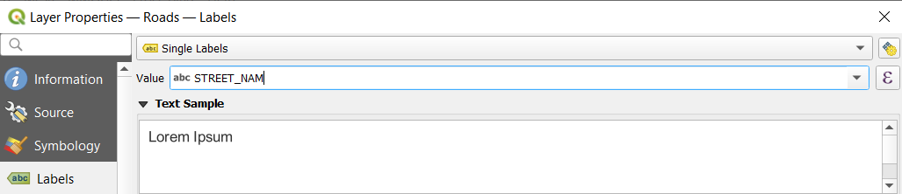
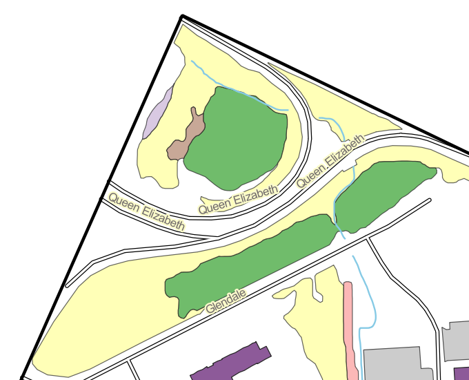
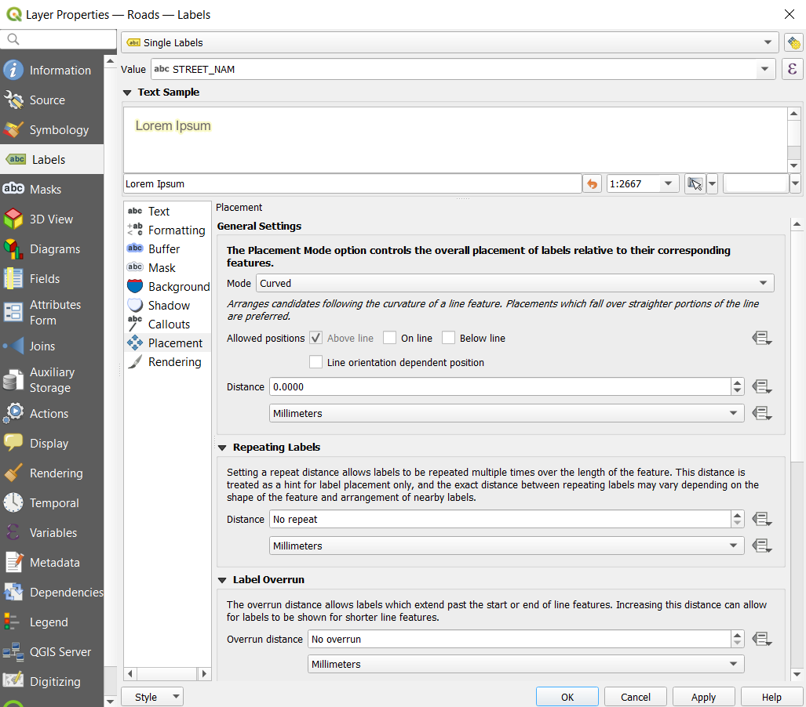
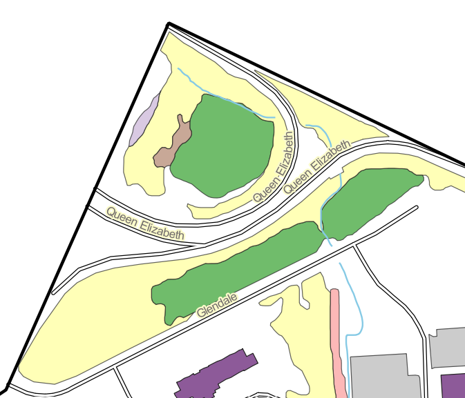

|LS| Labels
===============================================================================

Labels can be added to a map to show any information about an object. Any
vector layer can have labels associated with it. These labels rely on the
attribute data of a layer for their content.

**The goal for this lesson:** To apply useful and good-looking labels to a
layer.

|basic| |FA| Using Labels
-------------------------------------------------------------------------------

First, ensure that the |labeling| button is visible in the Graphic User interface 
(GUI):

#. Go to the menu item :menuselection:`View --> Toolbars`
#. Ensure that the :guilabel:`Label Toolbar` item has a check mark next to it.
   If it doesn't, click on the :guilabel:`Label Toolbar` item to activate it.

Note

Take a moment and examine the list of available toolbars.  As we move forward in
the course, we will be working with some of these toolbars (e.g., Digitizing toolbar,
Snapping toolbar, Raster toolbar, etc.).

#. Click on the ``wild_species`` layer in the :guilabel:`Layers` panel so that
   it is highlighted
#. Click on the |labeling| toolbar button to open the
   :guilabel:`Labels` tab of the :guilabel:`Layer Styling` panel

#. Switch from :guilabel:`No Labels` to |labeling| :guilabel:`Single Labels`

   You'll need to choose which field in the attributes will be used for the
   labels. In the previous lesson, you decided that the ``Species`` field was the
   most suitable one for this purpose.

#. Select ``SPECIES`` from the Value list:

   .. figure:: img/Classification_specieslabels.png
      :align: center

#. Click :guilabel:`Apply`

The map should now have labels like this:

|basic| |FA| Changing Label Options
-------------------------------------------------------------------------------

Depending on the styles you chose for your map in earlier lessons, you might
find that the labels are not appropriately formatted and either overlap or
are too far away from their point markers.

.. note::  Above, you used the |labeling| button in the
   :guilabel:`Label Toolbar` to open the :guilabel:`Layer Styling` panel. As
   with :guilabel:`Symbology`, the same label options are available via both
   the :guilabel:`Layer Styling` panel and the :guilabel:`Layer Properties`
   dialog. Here, you'll use the :guilabel:`Layer Properties` dialog.

#. Open the :guilabel:`Layer Properties` dialog by double-clicking on the
   ``wild_species`` layer
#. Select the |labeling| :guilabel:`Labels` tab
#. Make sure :guilabel:`Text` is selected in the left-hand options list, then
   update the text formatting options to match those shown here:

   .. figure:: img/Classification_text9.png
      :align: center

#. Click :guilabel:`Apply`

   That font may be larger and more familiar to users, but its readability is
   still dependent on what layers are rendered beneath it. To solve this,
   let's take a look at the :guilabel:`Buffer` option.

#. Select :guilabel:`Buffer` from the left-hand options list
#. Select the checkbox next to :guilabel:`Draw text buffer`, then choose
   options to match those shown here:

   .. figure:: img/Classification_buffer.png
      :align: center

#. Click :guilabel:`Apply`

   You'll see that this adds a colored buffer or border to the place labels,
   making them easier to pick out on the map:

   .. figure:: img/Classification_bufferresult.png
      :align: center

   Now we can address the issue of multiple wood duck labels. Sometimes labels 
   need to be manually adjusted.  You can use the different tools from
   the Label Toolbar to modify your labels.  In our case, where we have multiple 
   wood duck labels, we want to reduce the labels to a single label. To do this:

#. Click |mActionMoveLabel| `Show/Hide Labels and Diagrams` tool and then click on one of the wood
duck labels.

   A dialogue box will appear; select `id` as shown in the figure below.

   .. figure:: img/Classification_primarykey.png
      :align: center

#. Click on the individual wood duck labels to remove each label.  Be sure to leave one.
#. Navigate back to the Label Toolbar and click |mActionShowHideLabels| `Move a Label, 
   Diagram or Callout` tool, and then click on the last remaining wood ducks label and position 
   it as shown below.

   .. figure:: img/Classification_woodducklabelsmove.png
      :align: center

   Now we can address the positioning of the labels in relation to their point
   markers. 

#. Select :guilabel:`Placement` from the left-hand options list
#. Select :guilabel:`Around point` and change the value of
   :guilabel:`Distance` to ``2.0`` Millimeters:

   .. figure:: img/Classification_placement.png
      :align: center

#. Click :guilabel:`Apply`

   You'll see that the labels are no longer overlapping their point markers.

|moderate| |FA| Using Labels Instead of Layer Symbology (Optional)
-------------------------------------------------------------------------------

In many cases, such as point datasets associated with places (e.g., cities, provinces, 
countries, etc.), the location of a point doesn't need to be very specific. 
The points in the ``wild_species`` layer refer to specific locations, however,
you may work with datasets for towns, suburbs, etc., where the specific point 
associated with such features is not specific on a large scale. In fact, giving a 
point that is too specific is often confusing for someone reading a map.

To name an example: on a map of the world, the point given for the European
Union may be somewhere in Poland, for instance. To someone reading the map,
seeing a point labeled *European Union* in Poland, it may seem that the capital
of the European Union is therefore in Poland.

So, to prevent this kind of misunderstanding, it's often useful to deactivate
the point symbols and replace them completely with labels.  For the purpose of
practice, we will use the wild_species dataset.

In QGIS, you can do this by changing the position of the labels to be rendered
directly over the points they refer to.

#. Open the |labeling| :guilabel:`Labels` tab of the
   :guilabel:`Layer Properties` dialog for the ``wild_species`` layer
#. Select the :guilabel:`Placement` option from the options list
#. Click on the :guilabel:`Offset from point` button

   This will reveal the :guilabel:`Quadrant` options which you can use to set the
   position of the label in relation to the point marker. In this case, we want the
   label to be centered on the point, so choose the center quadrant:

   .. figure:: img/Classification_offsetfrompoint.png
      :align: center

#. Hide the point symbols by editing the layer :guilabel:`Symbology` as usual,
   and setting the size of the :guilabel:`Marker` size to ``0.0``:

   .. figure:: img/Classification_marker0.png
      :align: center

#. Click :guilabel:`Apply`

If you were to zoom out on the map, you would see that some of the labels
disappear at larger scales to avoid overlapping. Sometimes this is what you
want when dealing with datasets that have many points, but at other times
you will lose useful information this way. There is another possibility for
handling cases like this, which we'll cover in a later exercise in this lesson.
For now, zoom out and click on the |showUnplacedLabel| button in the toolbar
and see what happens.

|moderate| |FA| Labeling Lines
-------------------------------------------------------------------------------

Now that you know how labeling works, there's an additional problem. Points and
polygons are easy to label, but what about lines? 

#. Activate |labeling| :guilabel:`Single Labels` for the ``roads``
   layer using the settings shown below.

:align: center

What do you notice? If you label them the same way as the points, your results 
like this:

.. figure:: img/Classification_badstreetnames.png
   :align: center

We will now reformat the ``roads`` layer labels so that they are easy to
understand.

#. Set the font :guilabel:`Size` to ``8`` so that you can see more labels
#. Zoom in towards the ``roads`` layer

   You'll probably find that the text styling has used default values and the
   labels are consequently very hard to read. Update the :guilabel:`Text`
   to use a dark-grey or black :guilabel:`Color` and the :guilabel:`Buffer`
   to use a light-yellow :guilabel:`Color`.

   The map will look somewhat like this, depending on scale:

   Try out different :guilabel:`Placement` settings as well. The default
   :guilabel:`Horizontal` option is not a good idea in this case, so let's
   try the :guilabel:`Curved` option instead.

#. Select the :guilabel:`Curved` option in the :guilabel:`Placement` panel of
   the :guilabel:`Labels` tab shown below.

Here's the result:

   Using `Curved` option actually eliminated duplicate labels.  

#. Another way to remove duplicates is by navigating to the :guilabel:`Labels` tab 
   of the :guilabel:`Layer Properties` dialog, choose the :guilabel:`Rendering` option 
   and select :guilabel:`Merge connected lines to avoid duplicate labels`.

|IC|
-------------------------------------------------------------------------------

You've learned how to use layer attributes to create labels. This can
make your map a lot more informative and stylish!

|WN|
-------------------------------------------------------------------------------

Now that you know how attributes can make a visual difference for your map, how
about using them to change the symbology of objects themselves? That's the
topic for the next lesson!

.. Substitutions definitions - AVOID EDITING PAST THIS LINE
   This will be automatically updated by the find_set_subst.py script.
   If you need to create a new substitution manually,
   please add it also to the substitutions.txt file in the
   source folder.

.. |FA| replace:: Follow Along:
.. |IC| replace:: In Conclusion
.. |LS| replace:: Lesson:
.. |TY| replace:: Try Yourself
.. |WN| replace:: What's Next?
.. |basic| image:: /static/common/basic.png
.. |changeLabelProperties| image:: /static/common/mActionChangeLabelProperties.png
   :width: 1.5em
.. |dataDefined| image:: /static/common/mIconDataDefine.png
   :width: 1.5em
.. |hard| image:: /static/common/hard.png
.. |labeling| image:: /static/common/labelingSingle.png
   :width: 1.5em
.. |majorUrbanName| replace:: Swellendam
.. |moderate| image:: /static/common/moderate.png
.. |moveLabel| image:: /static/common/mActionMoveLabel.png
   :width: 1.5em
.. |newAttribute| image:: /static/common/mActionNewAttribute.png
   :width: 1.5em
.. |openTable| image:: /static/common/mActionOpenTable.png
   :width: 1.5em
.. |pinLabels| image:: /static/common/mActionPinLabels.png
   :width: 1.5em
.. |rotateLabel| image:: /static/common/mActionRotateLabel.png
   :width: 1.5em
.. |showHideLabels| image:: /static/common/mActionShowHideLabels.png
   :width: 1.5em
.. |showPinnedLabels| image:: /static/common/mActionShowPinnedLabels.png
   :width: 1.5em
.. |showUnplacedLabel| image:: /static/common/mActionShowUnplacedLabel.png
   :width: 1.5em
.. |toggleEditing| image:: /static/common/mActionToggleEditing.png
   :width: 1.5em
